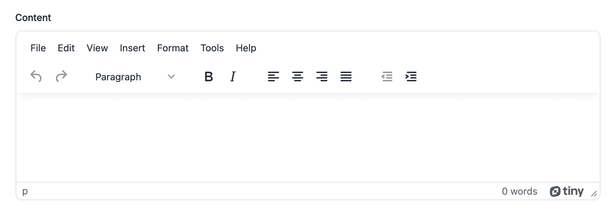

# TinyMCE Cloud Fieldtype for Statamic

<!-- statamic:hide -->

---

<!-- /statamic:hide -->

> ⚠️ Maintenance Status - July 27, 2026
>
> This package is no longer actively developed, and will not be supported after Statamic 6. 
>
> I no longer use TinyMCE in any of my projects, and Statamic offers much better core functionality for content
> authoring, management and flexibility within the Statamic platform.
>
> **For new users to Statamic**, take some time to understand how Bard works: while it may have a learning curve for you
> now, in the long term, you'll be in a much happier place. You can still make your own extensions using Vue, and
> Statamic have made it extensible within the CP.
>
> If someone would like to adopt the project, feel free to get in touch.

This is a TinyMCE Cloud Fieldtype for Statamic utilising the cloud-hosted version of TinyMCE.

This requires a free API key from [tiny.cloud](https://www.tiny.cloud), and simplifies your build steps as the cloud
version will always run the latest version from Tiny, and doesn't need to be included in your app's bundle.

In the configuration you are able to choose which TinyMCE version you want to use - you now have the choice of 
TinyMCE version 5, 6 or 7.

## Documentation

See the [documentation](https://docs.mity.com.au/tinymce-cloud) for detailed installation, configuration and usage
instructions.

## Support

We love to share work like this, and help the community. However it does take time, effort and work.

The best thing you can do is [log an issue](../../issues).

Please try to be detailed when logging an issue, including a clear description of the problem, steps to reproduce the
issue, and any steps you may have tried or taken to overcome the issue too. This is an awesome first step to helping us
help you. So be awesome - it'll feel fantastic.

## Credits

- [Marty Friedel](https://github.com/martyf)
- [Igor](https://github.com/IVoyt) for a bug fix

Makes use of:
- [TinyMCE Vue component](https://github.com/tinymce/tinymce-vue)

## License

The MIT License (MIT). Please see [License File](LICENSE.md) for more information.
